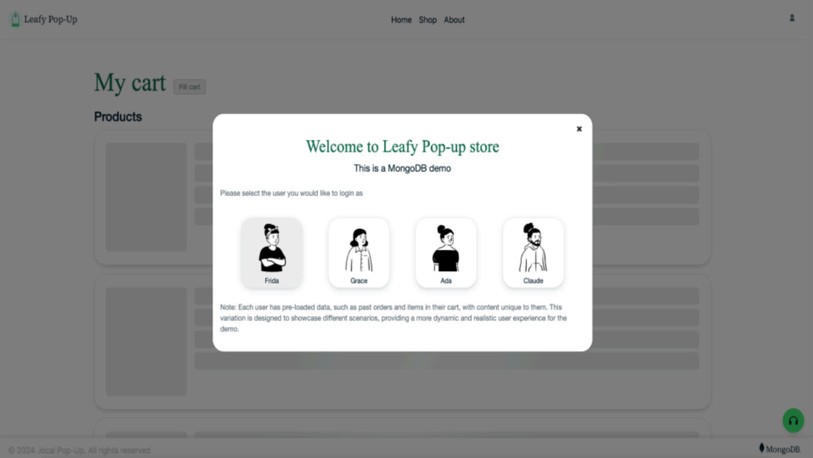

# Omnichannel ordering solution

# WORK IN PROGRESS NOT YET FINISHED!!! 

## Table of Contents
<details>
  <ol>
    <li><a href="#prerequisites">Prerequisites</a></li>
    <li><a href="#initial-configuration">Initial Configuration</a></li>
    <li><a href="#demo-overview">Demo Overview</a></li>
    <li><a href="#product-embeddings">Product Embeddings</a></li>
    <li><a href="#authors-&-contributors">Authors & Contributors</a></li>
    </ol>
</details>

## Prerequisites

Make sure to have the following tools to follow along smoothly and run this demo on your own environment.
* MongoDB Atlas Account. Create an Atlas account at https://cloud.mongodb.com and provision a Cluster. You can follow the instructions from this article to set up your Cluster.
* Voyage AI account. TODO
* Azure account. TODO
* Install Node. This will be required to install the node modules which contain all the necessary packages to run our demo. 
* Install Git. This will be required to clone the demo repository.

## Initial Configuration

### Step 1. Clone the repository
Start by obtaining the demo code. Open your terminal, navigate to the directory where you want to store the code, and run the following command:

git clone https://github.com/mongodb-industry-solutions/retail-store-v2.git

### Step 2. Set up environment variables and install dependencies
Navigate to the project directory and create a file called .env.local at the root level. This file is essential for managing configuration settings, especially when it contains sensitive information such as private keys.

```bash
cd retail-store-v2
touch .env.local 
```

Note: For Window’s users, replace touch .env.local with echo $null >> .env.local 

Open the .env.local file that you just created, and add the following environment variables.

```bash
MONGODB_URI=<mongodb connection string>
DATABASE_NAME="leafy_popup_store"
COLLECTION_NAME="orders"
NODE_ENV="development"
NEXT_PUBLIC_GCP_INVOICE_URL=<url of the download PDF invoice url azure function>
```

Leave the MONGODB_URI blank for now, you will retrieve its value on Step 3. 

The instructions to obtain the NEXT_PUBLIC_GCP_INVOICE_URL variable are defined inside the [invoice microservice backend README](https://github.com/mongodb-industry-solutions/retail-digital-receipts-backend/blob/main/services/invoice-ms/README.md#2-pdf-rendering-on-demand)

Install the node modules executing the following command:

```bash
npm install
```

This installation might take a few moments to complete, as all the required packages are being downloaded and installed into the project. Once the command finishes executing, a new folder named ‘node_modules’ will appear at the root level of the application code, containing the installed dependencies.

### Step 3. Retrieve your connection string
A MongoDB connection string is required to connect to the cluster you created in the ‘Prerequisites’ section. Follow the steps provided in [this article](https://www.mongodb.com/resources/products/fundamentals/mongodb-connection-string#:~:text=How%20to%20get%20your%20MongoDB,connection%20string%20for%20your%20cluster.) to retrieve your connection string. 

When choosing your connection method for MongoDB, select the option labeled ‘Drivers’, as illustrated in Figure 1.


Figure 1. Atlas screen to choose a connection method.

Once you select the ‘Drivers’ option copy the provided connection string. It should look something like this:

```bash
mongodb+srv://<username>:<password>@<clusterAddress>
```

Great job! Assign the connection string to the MONGODB_URI variable replacing <username> and <password> with your actual credentials and save the changes. Your .env.local file should now resemble the following:

```bash
MONGODB_URI=mongodb+srv://<username>:<password>@<clusterAddress>
DATABASE_NAME="leafy_popup_store"
COLLECTION_NAME="orders"
NODE_ENV="development"
NEXT_PUBLIC_GCP_INVOICE_URL=<url of the download PDF invoice url azure function>
```

###  Step 4. Populate your database
Next, populate your database with the required data and metadata required for the demo. In the application code locate the dump/leafy_popup_store directory. Inside it, there are several .gz files which contain the data and metadata of the collections: users, products, orders, locations and carts.

Use the [mongorestore](https://www.mongodb.com/docs/database-tools/mongorestore/) command to load the data from the database dump into a new database within your Cluster.

Let's go back to your terminal, navigate to the directory /retail-store-v2 (the root level of the application code), and run the following command:

```bash
mongorestore --gzip --dir=dump/leafy_popup_store --db=leafy_popup_store --uri "mongodb+srv://<user>:<password>@<cluster-url>"
```

This command will create the database and collections and log its progress. Upon completion, you should see a log like this:

```bash
92 document(s) restored successfully. 0 document(s) failed to restore.
```

Perfect! You now have your application code with environment variables, all the dependencies installed and the database created with the required data loaded.


Curious about how the database dump was generated? Check out  the documentation for the mongodump command. 

###  Step 5. Setup the backend

To enable digital receipts and personalized recommendations, two microservices must be set up. These services are located in a separate backend repository. Please refer to that [repository's README](https://github.com/mongodb-industry-solutions/retail-digital-receipts-backend) for detailed setup instructions.

### Step 6. Run the demo
Now you are all set to run the demo. Go back to the terminal, at the root of the application code execute the following command:

```bash
npm run dev
```

Then, open your browser and navigate to http://localhost:8080/cart and you should see the interface shown on Figure 3.


Figure 3. Omnichannel Ordering demo interface.

Congratulations, you have successfully set up the demo in your own environment! Select any user to see their cart and click on ‘Proceed to checkout’ to start your Omnichannel Ordering experience.


## Demo Overview

When first accessing the demo you’ll be presented with the Login screen (Figure 4) where you can choose which user you want to login with. All users represent a customer and have the same privileges, the only variation between each user is that they have different pre-loaded data, such as their name, their address, their orders history and items in their cart. 


Figure 4. Login screen

 After choosing a Persona, navigate to ‘My cart’ screen (Figure 5) by clicking on the User icon in the top right corder and 'My Cart'. Here, you will see a few products already loaded to your cart. If you do not have any, don't worry we added a “Fill Cart” button to automatically add some random products to the cart so you can continue with the demo.

TODO CART IMAGE!
Figure 5. My Cart screen

Once you are ready to move forward click on the “Proceed to Checkout”.
Select your preferred shipping method and click on “Confirm & order”. This will generate the new order and redirect you to the ”Order Details” page (Figure 5).

TODO CART IMAGE!
Figure 6. Order Details page

At the top of the ‘Order details’ page you will see a Summary section with three columns. Click on "See details" inside the third column to open the digital receipt. 

### Undertanding the digital receipt

The e-receipt contains relevant invoice details such as the transaction timestamp, the order id, items purchased, total amount and loyalty points. At the bottom of the receipt, there is a list of product recommendations based on the items of this specific order.

Each digital receipt shows different recommendations. This is because the algorithm takes the most expensive product in the order and performs a vector search query on the catalog to retrieve the top 6 similar items. This ensures every digital receipt contains a unique and relevant set of suggestions leading to a more engaging shopping experience.

Additionally, shoppers can download their digital receipt at any point in time, as often as they need. This provides customers with easy access and organization of their expenses.

### Undertanding the personalized recommendations in landing page

When navigating to the landing page (Figure X), users will see the latest product recommendations in a carousel. We use the extended reference pattern to store the latest product recommendations inside the user document, enabling fast retrieval and ensuring the most up-to-date suggestions load quickly.

All of this comes together to create a smarter, more personalized post-purchase experience.

Figure X. Landing Page

## Product embeddings
The products in this demo include an embedding field called <code>vai_text_embedding</code>, which is essential for performing vector search. If you're replicating this demo, the provided dump file includes products with their embeddings already generated.

However, if you'd like to use a different dataset and create the embeddings yourself, you might be wondering: Where do these come from, and how are they generated?

In this section, we'll explore the embedding model used and the generation process in detail.

### Voyage AI
Voyage AI is a leader in embedding and reranking that dramatically improves the accuracy through AI-powered search and retrieval. Voyage AI has <strong>general purpose models</strong> ready for any purpose and language out-of-the-box, <strong>domain specific models</strong> that are highly optimized as well as <strong>Company specific models</strong> for companies to fine-tune.

To learn more about Voyage AI visit their [official website](https://www.voyageai.com/).

## Generating the embeddings


## Authors & Contributors

### Lead Authors   
[Prashant Juttukonda](https://www.mongodb.com/blog/authors/prashant-juttukonda) - Principal

[Rodrigo Leal](https://www.mongodb.com/blog/authors/rodrigo-leal) - Principal

[Genevieve Broadhead](https://www.mongodb.com/blog/authors/genevieve-broadhead) - Global lead, retail solutions

[Angie Guemes](https://www.mongodb.com/developer/author/angie-guemes-estrada/) – Developer & Maintainer 

[Florencia Arin](https://www.mongodb.com/blog/authors/florencia-arin) – Developer & Maintainer